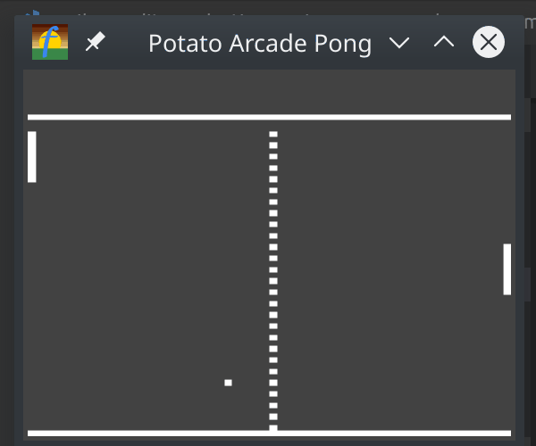

# Model P-64 Programmable Graphics Console

Introducing the Potato-64 emulator, written in 100% Go

(with a bit of OpenGL C code under the hood)


A fyne app  
http://fyne.io/fyne


## Install it

```
go get -u github.com/potato-arcade/p64
```

## Usage

Run the Potato Console

```
potato64 filename
```

eg - `potato64 ~/go/src/github.com/potato-arcade/p64/ROM/BOUNCY.BAS` to get up and running



Run the Basic Interpreter to test some code
```
p64basic filename
```


## The Machine

The Potato console contains the following components :

- The CPU
- The ROM Cartridge Slot
- The Memory Banks
- Video Controller
- The IO controller
- The Audio Controller

## ROM Cartridges

## Roll your own ROM


## TODO

- Overlay graphical image of the console, like Andy's Beeb emulator

- Bootup static to look like real static

- Extra Video Modes

- Text Mode

- Colors !!  Colored border

- Graphics primitives mapped to PotatoBASIC
    - LINE x,y,x2,y2,style
    - CIRCLE x,y,r
    - TEXT x,y,string
    - RECT x,y,x2,y2
    - FILLBOX x,y,x2,y2

- Sprites !

- Memory bank access to framebuffer

- Memory bank access to code

## If you like this, you should like these repos too

https://github.com/skx/gobasic

https://github.com/fyne-io/fyne

https://github.com/go-gl/glfw

## Further reading - some vids you might like, to get you in the mood for P64 coding

https://www.youtube.com/watch?v=XNRx5hc4gYc

https://www.youtube.com/watch?v=k4BCyfpP38Q

https://www.youtube.com/watch?v=zAndQn1p5L8

https://www.youtube.com/watch?v=WquhaobDqLU