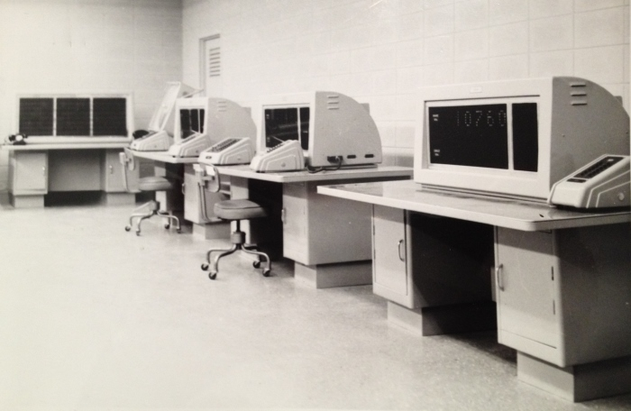
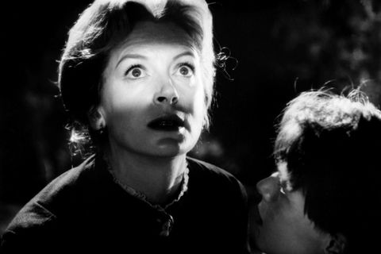

# Model P-64 Programmable Graphics Console

Introducing the Potato-64 emulator, written in 100% pure Go

A fyne app  http://fyne.io/fyne

(with a bit of OpenGL C code under the hood)

_Being something of a light hearted revolt against modern coding norms, web development, and the cult of the "FullStack" developer._



_This little toy is a weekend project to get into the heart and soul of the machine._

## What is it, and why should I care ?


The P64 is a virtual piece of hardware, intended as a minimalist platform to write and execute nifty little graphics programs on.

The capablities of the machine are deliberately limited 

- like the resolution (64x64)
- the refresh rate (24Hz fixed)
- the onboard memory store (64 'banks' of memory to store variables in)
- and of course ... the colour palette of the display  (Monochrome).



But like shooting black and white film in the digital age, these extremely limited constraints really force you to open up your creative side. To use the machine to tell a story.


You can write complete, and compelling games in an lunch break ....  but only if you think creatively, and code around the limitations of the hardware.  Getting your code to work well needs to you to think about the code from the machine's point of view.


Its literally BASIC, so its easy to get started with and easy to learn. But deceptively hard to master. 


Like a photographer armed with an old film camera, you have the same challenge of creating something compelling that jumps off the page. Its about the image, not the equipment.


Can YOU think up an addictive game that fits within the limitations of the hardware ?


## Install it

```
go get -u github.com/potato-arcade/p64
```

## Usage

Run the Potato Console

```
potato64 filename
```

eg - `potato64 ~/go/src/github.com/potato-arcade/p64/ROM/BOUNCY.BAS` to get up and running


Run the Basic Interpreter to test some code
```
p64basic filename
```


## The Machine

The Potato console contains the following components :

- The CPU
- The ROM Cartridge Slot
- The Memory Banks
- Video Controller
- The IO controller
- The Audio Controller

Because we are not trying to emulate any known machine, the definition of the P64 itself is entirely software driven - so we can give it additional concepts, features, bugs and limitations that do not even exist in any real hardware.


### The CPU, model P-88064

The CPU is a 64bit, single core machine that executes BASIC as its core instruction set, with some minor extensions.

On power up, the machine runs its startup BIOS diagnostics, loads the conntents of the ROM Cartridge into the memory banks, 
and then passes CPU control to run the code from the first code Memory Bank.

The `Escape` key is wired directly to the power switch - pressing it will perform a hard reboot of the machine to start the game again.

### The ROM Cartridge Slot, model RC64-110

The machine boots off a ROM Cartridge, which must be inserted into the machine before power on.

You do this when passing the filename of the ROM Cartridge to the `potato64` command on the command line.

ie - `potato64 ROM/TENNIS.BAS` will insert the Tennis Cartridge into the machine on boot.

This file must contain valid BASIC instructions.  Execution starts at the beginning of the file, and runs
sequentially until it hits the `END` statement.

So the first block of code in the ROM Cartridge, up to the first `END` statement is used to setup the game state, and write these into the memory banks for later use.


### The Memory Bank Controller, model MB-1492

The machine has 64 "Memory Banks", which are addressed by the numbers 1 - 64.

Each "Memory Bank" can be used to store 1 object, regardless of size. 

An Object can be :

- A String
- A Number
- An array of Numbers

How to use the memory banks in code - store a value to a memory bank.
```Basic
10 LET X = 10
20 POKE 1, X
```

How to use the memory banks in code - retrieve a value from a memory bank.
```Basic
10 X = PEEK 1
20 PRINT "The value of X is", X
```

Some of these Memory Banks are reserved for special purposes, but ALL of them are READ / WRITE !!

Reserved Memory Banks (TODO):

User Memory Banks
- 1 .. 32  User is free to use however they like.

Video Memory Banks
- 33 The Video Framebuffer, being an array of 4096 Numbers, arranged consequetively as 1st Row, 2nd Row ... 64th Row. 
- 34,35,36 - 2nd, 3rd, 4th Alternate Framebuffers 
- 37 Foreground Color, string RGBA
- 38 Background Color, string RGBA
- 39 Border Color, string RGBA
- 40 Video Control Register, a bitmask to control which of the framebuffers are displayed
- 41 Hue Modification Register 
- 46 Refresh Rate Register, number, can be used to select the framebuffer refresh rate
- 47 Image Effect Register, number, bitmask to select framebuffer post processing modes

Code Memory Banks
- 42 Boot Code. In this memory bank, you can find the complete BASIC code as loaded from the ROM Cartridge.
- 43 VSYNC Code for the interrupt handler.
- 44 KEYDOWN Code for the interrupt handler.
- 45 KEYUP Code for the interrupt handler.

... yes the code is user addressible, and user writable.  You could for example re-write the contents of the KEYDOWN handler inside some other code, if you really wanted to.

Audio Registers
- 48 The Audio Buffer, string, Notes to be played in an endless loop.
- 49 Secondary Audio Buffer, string, Notes to be played in an endless loop.
- 50 Audio Sample Buffer, string, Notes to be played once.
- 51 Audio Mixer Register, number, bitmask of active channels.

Free for later use
- 52 .. 60  Not used

Sprite Controllers [Classified] - not available yet
- 61 1st Sprite Register, string, contains x,y location, bitmap and bitmask, collision detection bit for sprite 1
- 62 2nd Sprite Register
- 63 3rd Sprite Register
- 64 4th Sprite Register

Debug intruction to view the whole available memory bank internals :
```
10 DEBUG
```

This will dump the entire contents of the memory banks to the stdout, back on the host system.  Useful for getting things sorted out.

### Video Controller, model EnVideon-4K/24

The Video Controller is fixed frequency framebuffer device with a 4K capability.   (Thats 4K pixels in total)

Machine instructions to write to the framebuffer, and manipulate pixel in the 64x64 grid.
```Basic
REM Clear the framebuffer to the background color
10 CLEAR

REM Set a pixel at a location
20 SET X,Y,1

REM Clear a pixel at a location
30 SET X,Y,0

REM Read a pixel at a location
40 LET PX = AT(X,Y)
```

This model of video controller executes a framebuffer read at a rate of 24Hz (every 41ms or so), at which point it draws the current framebuffer onto the video output as an array of 64x64 dots.

After that, it generates a VSYNC interrupt, which the CPU then picks up and uses to call the code to start building the next frame.

>Vertical Sync Interrupt (VSYNC)
>
>This interrupt is generated when the video controller has completed one clean pass of outputting a frame to the video output.

Writing code to be executed on VSYNC :
- Use the `.INTR VSYNC` keyword in your ROM Cartridge code to add a routine to be executed on VSYNC.
- End your video routine with the `END` keyword. Be super careful where you put this, as you cannot GOSUB to functions outside of this block.
- Use `PEEK` to retrieve state data from the Memory Banks. Program variables used in other code are temporary and have a life cycle of 1 interrupt routine. So they cannot be accessed in different interrupt control code, or between different calls to the same interrupt handler ...  so you NEED to use the Memory Banks to share state.
- Use `POKE` to save state data back to the Memory Banks before exiting your VSYNC interrupt handler.

Example code for a complete VSYNC interrupt handler :
```Basic
.INTR VSYNC
CLEAR
LET X = PEEK 1
LET Y = PEEK 2
LET DX = PEEK 3
LET DY = PEEK 4
X = X + DX
Y = Y + DY
PRINT

100 GOSUB 1000
110 GOTO 2000

1000 IF X > 0 THEN RETURN
1010 X = 1
1020 DX = 1
1030 RETURN

2000 SET X,Y,1
2010 POKE 1, X
2020 POKE 2, Y
2030 POKE 3, DX
2040 POKE 4, DY
END
```

Video Memory Banks of interest [Classified] 

- 33 The Video Framebuffer, being an array of 4096 Numbers, arranged consequetively as 1st Row, 2nd Row ... 64th Row. 
- 34,35,36 - 2nd, 3rd, 4th Alternate Framebuffers 
- 37 Foreground Color, string RGBA
- 38 Background Color, string RGBA
- 39 Border Color, string RGBA
- 40 Video Control Register, a bitmask to control which of the framebuffers are displayed
- 41 Hue Modification Register 
- 46 Refresh Rate Register, number, can be used to select the framebuffer refresh rate
- 47 Image Effect Register, number, bitmask to select framebuffer post processing modes

In the current release, access to these advanced hardware features are still classified, and locked down due to NDAs with powerful Government entities. Will open up these features as time, and our legal department permit.

Future additional BASIC functions for graphics primitives (TODO)

```Basic
REM Draw a Line
10 LINE X1,Y1,X2,Y2

REM Draw a Cirle
20 CIRCLE X,Y,R

REM Draw a Rect outline
30 RECT X1,Y1,X2,Y2

REM Draw a Filled Rectangle
40 BOX X1,Y1,X2,Y2

REM Flood Fill from a point till it hits a non-blank pixel
50 FILL X,Y

REM Blit Copy between framebuffers
60 BLIT DSTFramebuffer, SRCFramebuffer

REM Hue control of the whole palette, values 0-63
70 HUE X

REM Set color palette
80 COLOR Foreground, Background, Border

REM Framebuffer control
90 SHOW Framebuffer,OnOff

REM Effects control, Work in progress
100 EFFECT ID,OnOff
```

See https://github.com/anthonynsimon/bild to get an idea of the effects overlays that the video controller (may) support

### The IO controller, model P64-IC-1493

The machine includes an IO controller that reads events from the keyboard, and generates interrupts on the IO bus.

When a key is first pressed down, the IO Controller generates an interrupt immediately, and sets the reserved variable name `KEY` to the name of the key pressed.

You can easily hook code up to these key events using the `KEYDOWN` and `KEYUP` interrupt handlers.

eg - Some keyboard handlers to move a spaceship up and down. As the Up/Down key is pressed, it sets the "DeltaY" value and stores it in memory bank 1.  On KeyUp, the DeltaY value is cleared.

On VSYNC, the spaceship vertical position is modified by DeltaY.

So the overall effect is that as long as the key is held down, the spaceship will move in that direction at a constant rate of 1 dot @ 24Hz, regardless of how fast your host machine is. Nice !

```Basic
.INTR KEYDOWN
10 DY = PEEK 1
20 IF KEY = "Up" THEN DY = -1
30 IF KEY = "Down" THEN DY = 1
40 POKE 1, DY
END

.INTR KEYUP
100 POKE 1, 0
END

.INTR VSYNC
200 DY = PEEK 1
210 X = PEEK 2
220 Y = PEEK 3
230 Y = Y + DY
240 PRINT "Spaceship is now at", X,Y
```

Note the use of the special var `KEY` which is automatically set.

For a complete list of Key event names, experiment by writing some code, and see what you get.

```Basic
.INTR KEYDOWN
10 PRINT KEY,"\n"
END
```

### The Audio Controller [Classified]

The machine includes a hi-tech, quadrophonic music sythensizer chip ... that is so secret that the exact details are currently Classified.

More info later as the audio device is revealed.

## Roll your own ROM

Making your own ROM Cartridges is easy - just edit them offline in a good editor, and test them by running them in the virtual machine.

While the documentation is pretty good, its still an exersize in discovery, and debugging errors can be frustrating at best.

Persist, and see how you go.

Use one of the existing ROM Cartridges as a base, copy it, change it, and observe what happens.

Then ... fine tune your idea.

You can also use the standalone `p64basic` command (which is installed as part of this package) to test out PotatoBASIC ROM files without the GUI frontend.  Very useful for testing and executing PotatoBASIC server code that you might be running in the cloud, and can only access via ssh.

## Bugs !

The BASIC compiler is a bit buggy, sometimes.

The use of `=` as a comparison operator sometimes gets confused as an assignment operator, and throws weird errors about "LET" commands that you dont have in the offending code.

eg `IF X = 0 THEN PRINT "X is zero"`  doesnt always like the `=` in there.

You can generally get around this by using line numbers on the offending code, and sometimes throwing in an empty `PRINT` as a nop that will mostly get the BASIC evaluation back on track, if you are lucky.

Dont know :(

Also - Resource thrashing !!

Every 24Hz cycle, the machine instantiates a complete new BASIC environment, compiles the code, and executes the portion of code in the VSYNC handler.  This works well enough, but after a short enough while, the virtual machine starts to bog down excessively.

I suspect this is due to large pauses of GC that need to clean up the mess that each dropped instance of BASIC leaves behind.

Fix is to rewrite the BASIC compiler to have some resource caching and re-execution of existing code blocks when calling the same code over and over again.  Exersize for another day. Defs a job for a long weekend.

Screen Scaling.

You can re-size the screen, and the potato64 will rescale the output to fit the new dimensions.

This puts quite a strain on the system though, because the virtual machine needs to render an image that fits the whole of the newly resized window.  Regardless of the fact that the underlying framebuffer is limited to 64x64, the scaling might mean that it needs to interpolate many millions of pixels.  Ouch !

This will work, but it really eats into your 24Hz window to get each frame painted.

Could address this by parallelizing some of the rendering code to make better use of multi-core machines, or use the underlying OpenGL hardware to do more work.  (Its possible to inject shaders into the graphics handling .. but thats defs another weekend project)

A slightly better way of scaling the output is to set the `FYNE_SIZE` ENV Var to a larger number.

eg : 
`FYNE_SIZE=2 potato64 ROM/TENNIS.BAS` performs a bit better that simply dragging the window out to a bigger size.  Its still 4 times the load on the host machine though, so be mindful of that.


## TODO

- Overlay graphical image of the console, like Andy's Beeb emulator https://github.com/andydotxyz/beebui

- Bootup static to look like real static

- Extra Video Modes

- Text Mode

- Colors !!  Colored border

- Sprites !

- Extra framebuffers, with BLIT commands to fast copy between them

- Memory bank access to framebuffer

- Memory bank access to the ROM code, so you can write self-modifying code

## If you like this, you should like these repos too

https://github.com/andydotxyz/beebui  ** Parallel development of adding gobasic into fyne **

https://github.com/skx/gobasic   ** Awesome BASIC Compiler in Go **

https://github.com/fyne-io/fyne ** Awesome, Modern Native GUI framework for Go ** 

https://github.com/anthonynsimon/bild ** Awesome image hacking additions in Go **

https://github.com/go-gl/glfw ** Awesome Go bindings for awesome OpenGL framework **


More emulation in Go


https://gitlab.com/rastersoft/fbzx

https://github.com/remogatto/gospeccy

https://github.com/ichikaway/goNES/


## Further reading - some vids you might like, to get you in the mood for P64 coding

PONG - First documented Video Ping-Pong game - 1969

[](http://www.youtube.com/watch?v=XNRx5hc4gYc)

C64 peeks and pokes - people actually used to program like this .. and went on to do great things !

[](http://www.youtube.com/watch?v=k4BCyfpP38Q)
[](http://www.youtube.com/watch?v=zAndQn1p5L8)

Incredible story of how they recovered the Apollo mission control software from the dumpster

[](http://www.youtube.com/watch?v=WquhaobDqLU)